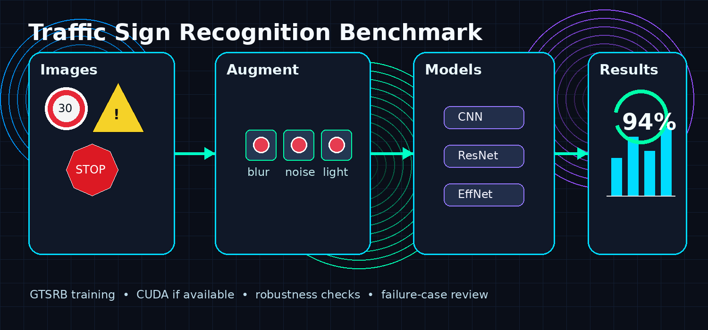

# Traffic Sign Recognition and Robustness Benchmark



## Overview

This repository contains a PyTorch-based traffic sign recognition benchmark. The project trains an image classifier in the GTSRB 43-class label space and evaluates the model with standard accuracy metrics, confusion matrices, robustness tests, and saved failure cases.

The training pipeline supports three data sources:

- German Traffic Sign Recognition Benchmark (GTSRB)
- Belgium Traffic Sign Dataset, when available locally or through the configured downloader
- Mapillary traffic-sign data, when available locally or through the configured downloader

The default configuration uses **combined training**. GTSRB is always used as the reference label system. External datasets are added to the training set only when their folder names can be mapped into the same 43 GTSRB classes. This avoids mixing incompatible labels from different datasets.

## Main Features

- Single-command training and evaluation through `main.py`
- CUDA support with mixed-precision training when available
- CPU execution that leaves a few cores free for the operating system
- GTSRB download through `torchvision`
- BelgiumTS and Mapillary download attempts through Kaggle mirrors
- Combined multi-source training with label remapping
- ResNet18, EfficientNet-B0, and a compact custom CNN
- Accuracy/loss curves
- Confusion matrix
- Robustness checks for noise, blur, and brightness shifts
- Misclassified example export
- CSV summaries for datasets, training history, and robustness results

## Project Structure

```text
traffic_sign_recognition_benchmark/
|
├── main.py
├── config.py
├── download_datasets.py
├── requirements.txt
|
├── src/
│   ├── data.py
│   ├── datasets_extra.py
│   ├── evaluate.py
│   ├── labels.py
│   ├── models.py
│   ├── multi_dataset.py
│   ├── plots.py
│   ├── robustness.py
│   ├── train.py
│   └── utils.py
|
├── figures/
├── outputs/
├── models/
└── data/
```

## Installation

Create and activate a Python environment, then install the dependencies:

```bash
pip install -r requirements.txt
```

For GPU training, install a CUDA-enabled PyTorch build that matches your CUDA version. The project automatically uses CUDA when PyTorch detects it.

## Running the Benchmark

Run the complete pipeline:

```bash
python main.py
```

The script will:

1. Create the required folders
2. Download datasets where possible
3. Build the combined training set
4. Train the selected model
5. Evaluate on the GTSRB test split
6. Save plots, metrics, and failure cases

## Dataset Modes

The dataset behavior is controlled in `config.py`:

```python
DATASET_MODE = "combined"
```

Available modes:

| Mode | Description |
|---|---|
| `combined` | Train on GTSRB plus compatible BelgiumTS/Mapillary images |
| `gtsrb` | Train only on GTSRB |
| `demo` | Run a small generated toy dataset for checking the code path |

## Combined Dataset Training

The model uses GTSRB's 43 traffic-sign classes as the common label space. This matters because different datasets do not always use the same class IDs, class names, or annotation format.

For external datasets, the loader checks the class folder names and maps them into GTSRB labels when possible. Examples that can be mapped include numeric folders such as `14`, `00014`, or text folders such as `stop`, `yield`, and `speed_limit_50`.

External images that cannot be mapped safely are skipped rather than being forced into the wrong class.

A summary of the sources used for training is saved to:

```text
outputs/training_sources.csv
```

## Configuration

Important settings in `config.py`:

```python
MODEL_NAME = "resnet18"
EPOCHS = 8
BATCH_SIZE = 96
USE_AMP = True
CPU_CORES_TO_LEAVE_FREE = 3
```

Supported models:

- `small_cnn`
- `resnet18`
- `efficientnet_b0`

## Outputs

The project saves figures and results after each run:

```text
figures/
├── accuracy_curve.png
├── loss_curve.png
├── confusion_matrix.png
└── robustness_comparison.png

outputs/
├── classification_report.txt
├── dataset_status.json
├── training_sources.csv
├── training_history.csv
├── robustness_results.csv
└── failure_cases/
```

A trained checkpoint is saved under:

```text
models/
```

## Notes on Dataset Access

GTSRB is downloaded directly through `torchvision.datasets.GTSRB`.

BelgiumTS and Mapillary may require external access depending on the mirror being used. The included downloader attempts to use Kaggle mirrors through `kagglehub`. If those datasets cannot be downloaded automatically, place them manually under:

```text
data/belgium/
data/mapillary/
```

For combined training, the folder structure should be compatible with `torchvision.datasets.ImageFolder`, where each class has its own subfolder.

## License

This project is intended for educational and research use. Dataset licenses and access terms remain with their original providers.
